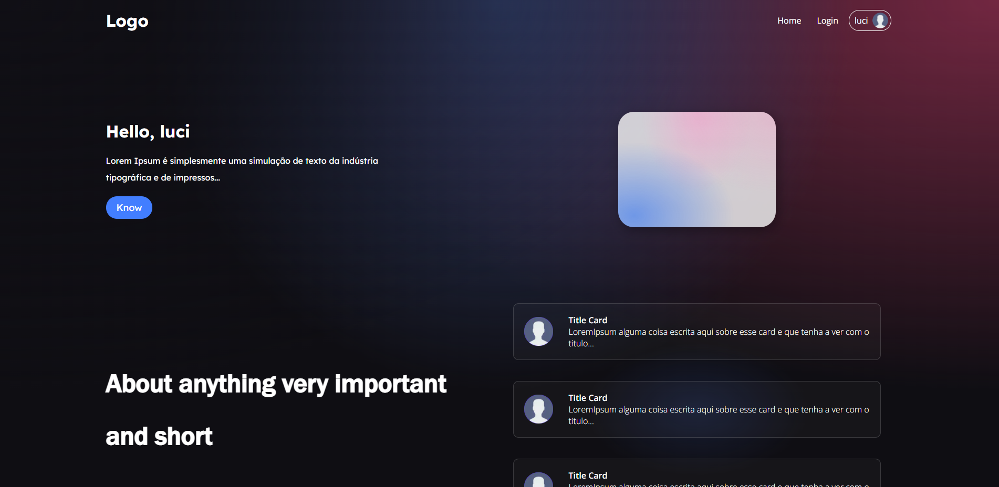

# <p align="center">:octocat: Repo for tests :octocat:</p>

<p align="center">Repository to test and study about react and nextjs</p>

<h1 align="center">

  

## 🛠 Technologies used

 


## ✨ Objectives

These are my goals for now, I believe that from small tests to small tests one day I will be able to build something big, or another small real project that uses some of these topics extremely well.

- [x] Create an application with React and NextJS from scratch
- [x] Responsive design integrating components well
- [x] Components
- [x] Routes
- [x] Consume API
- [ ] Authentication
- [x] Share data between components
- [x] ContextAPI

## 🚀 How to start

If you want to learn a little about how this application is being built, as well as the technologies used, take a look at this topic.

### 📌 Requirement

> node package manager (NPM or YARN)

> Git bash (optional, you can download the code directly from GitHub at 'code' > 'Download zip')

### ✨ Now are you ready to start

> clone the repository

```bash
git clone https://github.com/LuciLua/testes-next-js.git
```

> open project folder

```bash
cd ./testes-next-js
```

> install all packages using npm or yarn manager (using YARN)

```bash
yarn
```

> start the development server (using YARN)

```bash
yarn dev
```

### 🏗 Build

> to make a build (using YARN)

```bash
yarn build
```

> to start the server in production-ready mode (using YARN)

```bash
yarn start
```

## Preview

So far, this is the preview, but you can check it out at [this updated link](https://www.testesnextjs.ga/)



